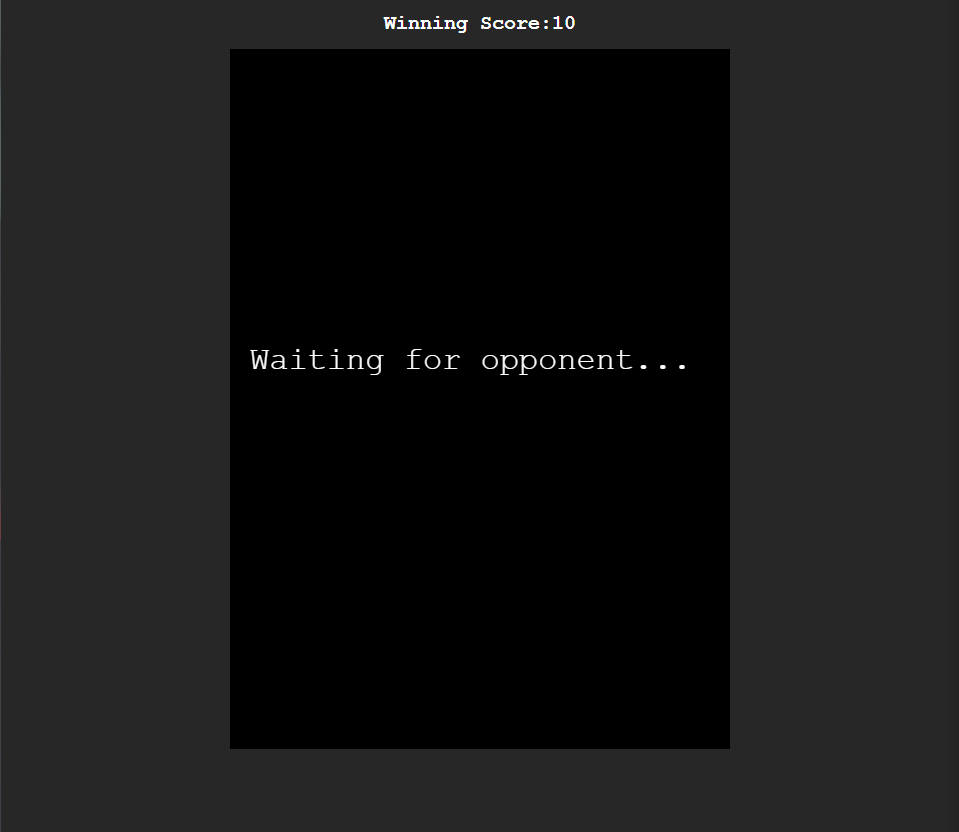
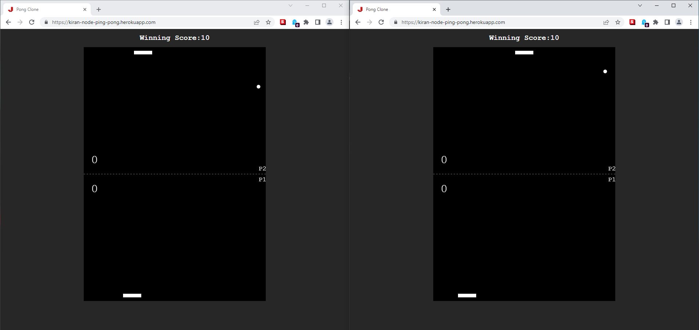
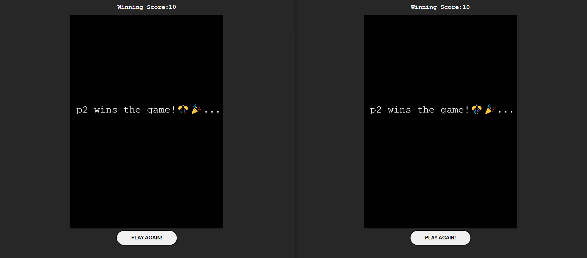

# multiPlayer-PingPong
Implementation using SOCKET.IO.  This project had been deployed in the heroku website to experience the demo!

- At any given time two players can play the game. This is possible with the help of socket.io which enables the **websocket** feature for the multiplayer game.

>RUN  `npm start`
>
>HEROKU https://kiran-node-ping-pong.herokuapp.com/

## Project Images

>Initially the palyer will be waiting for the opponent..

>When another player joins the game..both the player START's playing to win the points!

>After winning the required points, PLAY AGAIN button is enabled.

